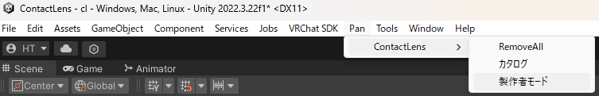
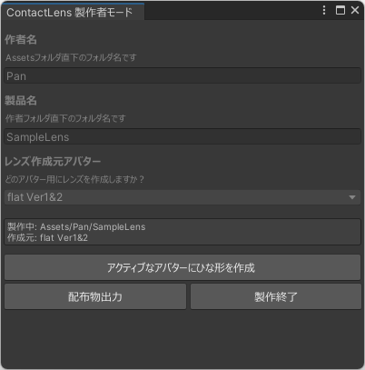
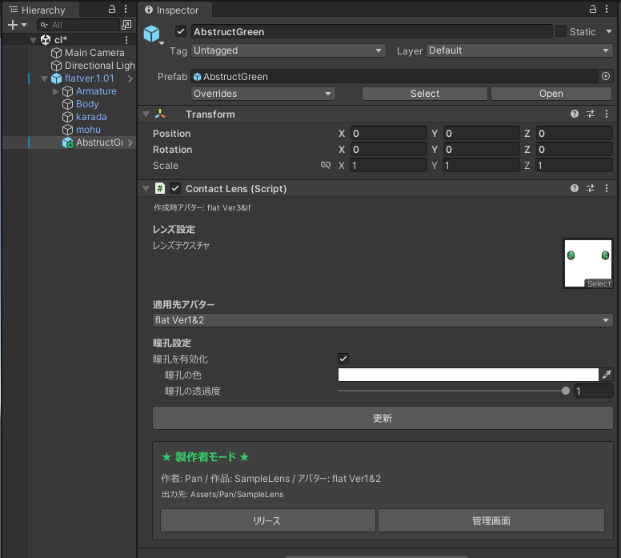

# ContactLens 製作者ガイド

コンタクトレンズテクスチャを作成し、配布するための手順です。

---

## 1. 準備

### レンズテクスチャの仕様
- **サイズ**: 2048x2048 推奨（作成元アバターの解像度に合わせる）
- **形式**: PNG
- **両目**: 左右両方の目を含める
- **目以外の部分**: 塗りつぶす

既存のSampleLensテクスチャを参考にしてください:
`Assets/Pan/SampleLens/res/tex/Sea.png`

---

## 2. 製作フロー

### Step 1: 製作者モードを開く
`Pan > ContactLens > 製作者モード` からウィンドウを開きます。

### Step 2: プロジェクト設定
- **作者名**: Boothの作者名など（フォルダ名になります）
- **製品名**: 製品のフォルダ名
- **レンズ作成元アバター**: テクスチャを作成したアバター

設定後「製作開始」を押します。
このとき、プロジェクトフォルダ(`Assets/{作者名}/{製品名}/`)が作成されます。

### Step 3: アバターにひな形を作成
1. Hierarchyでアバターを選択
2. 「アクティブなアバターにひな形を作成」をクリック
3. ContactLensオブジェクトが追加される

### Step 4: レンズテクスチャを設定
インスペクタで:
1. 「レンズテクスチャ」にテクスチャをドラッグ
2. 瞳孔設定を調整（適宜）
3. プレビューを確認（更新が必要な場合があります）

### Step 5: リリース
インスペクタ下部の「リリース」ボタンを押す:
- プロジェクトフォルダにプレハブが作成される

複数のレンズを作る場合は、Step 4-5を繰り返します。

### Step 6: 配布物出力
製作者モードウィンドウで「配布物出力」を押してフォルダを選択すると、Boothなどで配布するunitypackage, ReadMe.txtが生成されます。
ReadMe.txtはサンプルです。自由に編集してください。

---

## 3. 対応アバター

フラット族(フラット初代, 2nd, IF, 4th, コモド, フェル, ヘオン, キューフ)に対応しています。
テクスチャはどのアバター用に作っても、他のアバターに自動変換されます。
ただし、変換精度・ファイル容量の観点からフラットIf, 4thで作る、もしくは初代・2nd瞳孔なしのテクスチャで作ることが推奨です。

---

## 4. 注意事項

### ライセンス
Boothなどで公開する際は、元アバターのライセンスを確認し、著作者から適切な許可を取得してください。
本ツールは再配布してもよいですが、アップデート対応などが煩雑になることがあるので、なるべく私のBoothページからダウンロードするよう案内してください。
本ツールで作成したデータ(プレハブ、サムネイル等)は元アバターのライセンスの範囲内において自由に利用できます。

### 瞳孔について
フラット族は瞳孔がメッシュ式のものとテクスチャ描写式のものがあります。
完全不透明の場合、元々の仕様通りに表示します。
半透明を使った場合、全てテクスチャ描写式になるので、やや平面的な印象になります。

---

## 5. トラブルシューティング

### RemoveAll（復旧機能）
本ツールはなるべく安全を期して作っておりますが、複雑な操作をすると戻らなくなる/マテリアルエラーになる/頭が消えるなどの不具合がおきることがあります。
その場合 `Pan > ContactLens > RemoveAll` を実行すると復旧されます。
これを実行するとHierarchy上の全てのレンズを削除し、影響を除去しますので、リリースしていないものがあるときの使用には注意してください。

### テクスチャが反映されない
- 「更新」ボタンを押してください
- テクスチャのRead/Write Enabledを確認してください

### 目の位置がずれる
- 「目のスケール」で微調整できます
- 作成元アバターの設定を確認してください

### サムネイルが生成されない
- アバターにBodyメッシュがあることを確認してください
- Headボーンが見つからない場合、位置がずれることがあります
